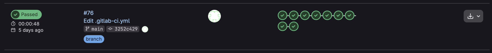
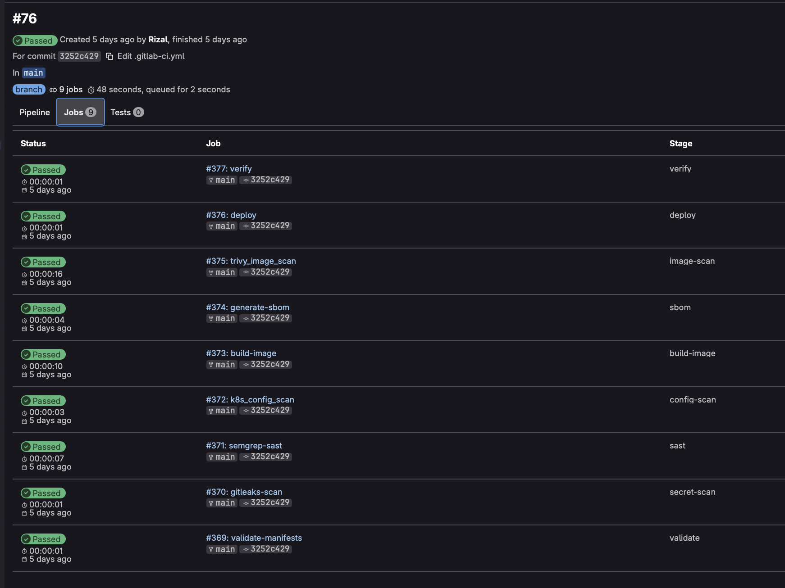
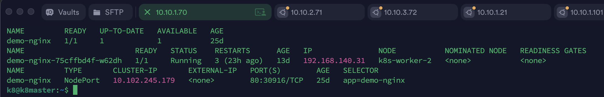

# gitlab-devsecops-pipeline

A hands-on DevSecOps CI/CD pipeline project using self-hosted GitLab, GitLab Runner, Kubernetes, and security scanning tools such as Gitleaks, Semgrep, Trivy, and Syft.

This project demonstrates how application delivery can be automated while security checks are enforced before deployment to Kubernetes.


---

## Overview

This project implements a DevSecOps pipeline that validates, scans, builds, deploys, and verifies a Kubernetes workload through GitLab CI/CD.

The pipeline is designed to simulate a real-world secure software delivery process where security is shifted left into the CI/CD workflow.

The pipeline includes:

- Kubernetes manifest validation
- Secret scanning
- Static application security testing
- Kubernetes configuration scanning
- Docker image build
- Software Bill of Materials generation
- Container image vulnerability scanning
- Kubernetes deployment
- Deployment rollout verification

---

## Problem Statement

Traditional CI/CD pipelines often focus only on build and deployment. Security checks are usually performed too late, after the application has already been deployed.

This can lead to:

- Secrets being committed into repositories
- Vulnerable dependencies entering the build
- Insecure Kubernetes manifests
- Container images with known CVEs
- Lack of deployment verification
- Weak visibility into release quality

This project solves that by integrating security checks directly into the CI/CD pipeline before deployment.

---

## Pipeline Architecture

```text
Developer Push
      ↓
GitLab CI/CD Pipeline
      ↓
Validate Kubernetes Manifests
      ↓
Secret Scan - Gitleaks
      ↓
SAST - Semgrep
      ↓
Kubernetes Config Scan - Trivy
      ↓
Build Docker Image
      ↓
Generate SBOM - Syft
      ↓
Image Scan - Trivy
      ↓
Deploy to Kubernetes
      ↓
Verify Rollout
```

---

## Pipeline Stages

| Stage | Tool | Purpose |
|---|---|---|
| Validate | kubectl | Validate Kubernetes manifests before deployment |
| Secret Scan | Gitleaks | Detect leaked secrets, tokens, passwords, and API keys |
| SAST | Semgrep | Detect insecure code patterns and security weaknesses |
| Config Scan | Trivy | Scan Kubernetes manifests for misconfigurations |
| Build | Docker | Build the application container image |
| SBOM | Syft | Generate Software Bill of Materials for dependency visibility |
| Image Scan | Trivy | Detect CVEs and vulnerabilities in the container image |
| Deploy | kubectl | Deploy the workload to Kubernetes |
| Verify | kubectl rollout | Verify that the Kubernetes deployment is healthy |

---

## Security Controls

| Security Control | Implementation |
|---|---|
| Secret detection | Gitleaks scans the repository for exposed credentials |
| Static code analysis | Semgrep checks source code for insecure patterns |
| Kubernetes manifest scanning | Trivy checks Kubernetes YAML files for misconfigurations |
| Container vulnerability scanning | Trivy scans the built Docker image for known CVEs |
| SBOM generation | Syft generates dependency inventory for supply chain visibility |
| Deployment validation | `kubectl rollout status` confirms deployment health |
| Credential protection | Sensitive values are stored as GitLab CI/CD variables and are not committed |

---

## Kubernetes Deployment

The pipeline deploys a demo workload into a Kubernetes cluster using GitLab CI/CD and kubectl.

Example deployment flow:

```text
GitLab Runner
      ↓
kubectl command
      ↓
Kubernetes API Server
      ↓
Namespace: demo
      ↓
Deployment + Service
      ↓
Application exposed via NodePort
```

---

## Repository Structure

```text
gitlab-devsecops-pipeline/
├── README.md
├── .gitlab-ci.yml
├── architecture/
│   └── pipeline-flow.md
├── kubernetes/
│   ├── namespace.yaml
│   ├── deployment.yaml
│   └── service.yaml
├── runbooks/
│   ├── deployment-runbook.md
│   ├── rollback-runbook.md
│   └── troubleshooting.md
├── screenshots/
│   ├── gitlab-pipeline-success.png
│   ├── pipeline-stages.png
│   ├── kubernetes-pods-running.png
│   └── deployment-rollout-success.png
└── docs/
    └── interview-explanation.md
```

---

## Deployment Validation

The deployment can be validated using:

```bash
kubectl get namespace demo
kubectl get pods -n demo
kubectl get svc -n demo
kubectl rollout status deployment/demo-nginx -n demo
```

Application access can be tested using NodePort:

```bash
curl http://<node-ip>:<nodeport>
```

Expected result:

```text
Welcome to nginx!
```

---

## Screenshots

| GitLab Pipeline Success |
|---|
|  |

| Pipeline Stages |
|---|
|  |

| Kubernetes Pods Running |
|---|
|  |

---

## Runbooks

Operational runbooks are included to document deployment, rollback, and troubleshooting procedures.

| Runbook | Description |
|---|---|
| [Deployment Runbook](runbooks/deployment-runbook.md) | Steps to deploy and validate the workload |
| [Rollback Runbook](runbooks/rollback-runbook.md) | Steps to rollback a failed deployment |
| [Troubleshooting Guide](runbooks/troubleshooting.md) | Common pipeline and Kubernetes issues |

---

## Interview Talking Points

This project demonstrates my ability to design and operate a secure CI/CD pipeline using GitLab and Kubernetes.

Key points I can explain:

- How GitLab CI/CD automates secure application delivery
- Why security scanning should happen before deployment
- How Gitleaks, Semgrep, Trivy, and Syft fit into a DevSecOps pipeline
- How Kubernetes deployments are validated after release
- How CI/CD credentials should be protected using GitLab variables
- How failed deployments can be rolled back using Kubernetes rollout commands
- How this pipeline can be improved for production with approval gates and GitOps

Example explanation:

> I built this GitLab DevSecOps pipeline to demonstrate secure software delivery into Kubernetes. The pipeline validates Kubernetes manifests, scans for secrets, runs SAST, checks Kubernetes configuration, builds a container image, generates an SBOM, scans the image for vulnerabilities, deploys to Kubernetes, and verifies the rollout. This shows how security can be shifted left while still maintaining automated delivery.

---

## Future Improvements

- Add manual approval before production deployment
- Add separate environments for dev, staging, and production
- Add GitOps deployment using ArgoCD
- Add image signing using Cosign
- Add admission control using Kyverno
- Add container runtime monitoring using Falco
- Add GitLab security dashboard integration
- Add automated rollback on failed health checks
- Add Slack or email notification for failed security stages
- Add policy-as-code enforcement using OPA or Conftest

---

## Author

**Tengku Rizal** — DevSecOps Engineer  
Building: GitLab CI/CD · Kubernetes · Wazuh SIEM · Terraform · Security Automation  
Location: Kuala Lumpur, Malaysia